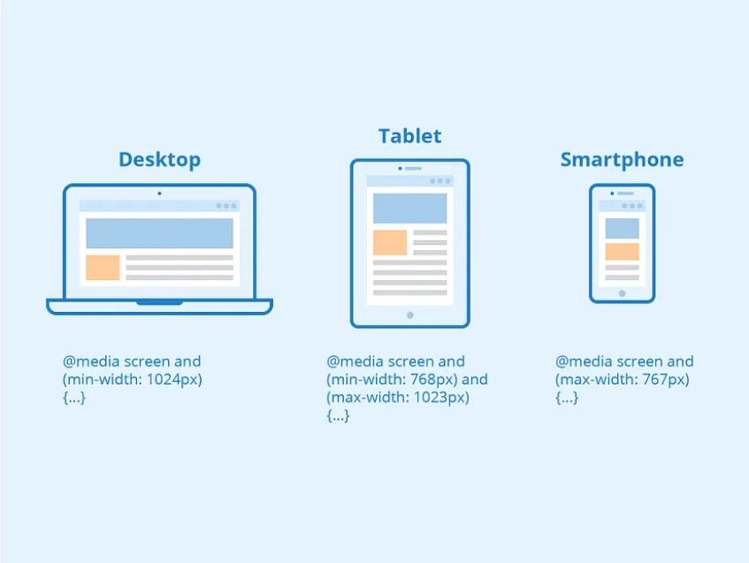

# Arquitetura do projeto

## :earth_americas: Pacotes instalados no projeto

+ Normalize ------ Comando de instalação `npm install normalize.css` :heavy_check_mark:
+ Css Modules ---- Comando de instalação `npm install -D typescript-plugin-css-modules sass` :heavy_check_mark:
+ ESLint --------- Comando de instalação `npm init @eslint/config` :heavy_check_mark:
+ Absolut import - Adição no arquivo `tsconfig.json` / `CompilerOption` / `"baseUrl": "src"` :heavy_check_mark:
+ ClassNames ----- Comando de instalação `npm install classnames` :heavy_check_mark:
+ Sass ----------- Comando de instalação `npm install -D typescript-plugin-css-modules sass` :heavy_check_mark:
+ React-router-dom Comando de instalação `npm install react-router-dom` :heavy_check_mark:
+ npx eslint ./src --fix
## Links úteis

+ Site com código de emojis [Clique aqui](https://github.com/ikatyang/emoji-cheat-sheet/blob/master/README.md).

+ Repositório Markdown [Clique aqui] (https://docs.github.com/pt/get-started/writing-on-github/getting-started-with-writing-and-formatting-on-github/quickstart-for-writing-on-github).

## Exemplo de Media Querys

